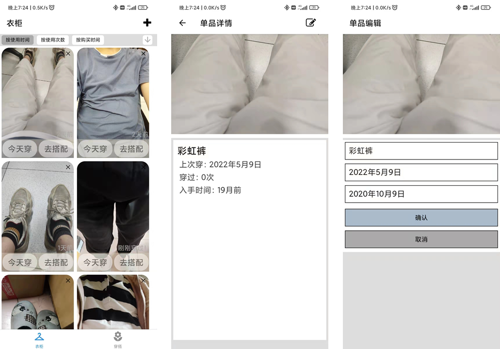
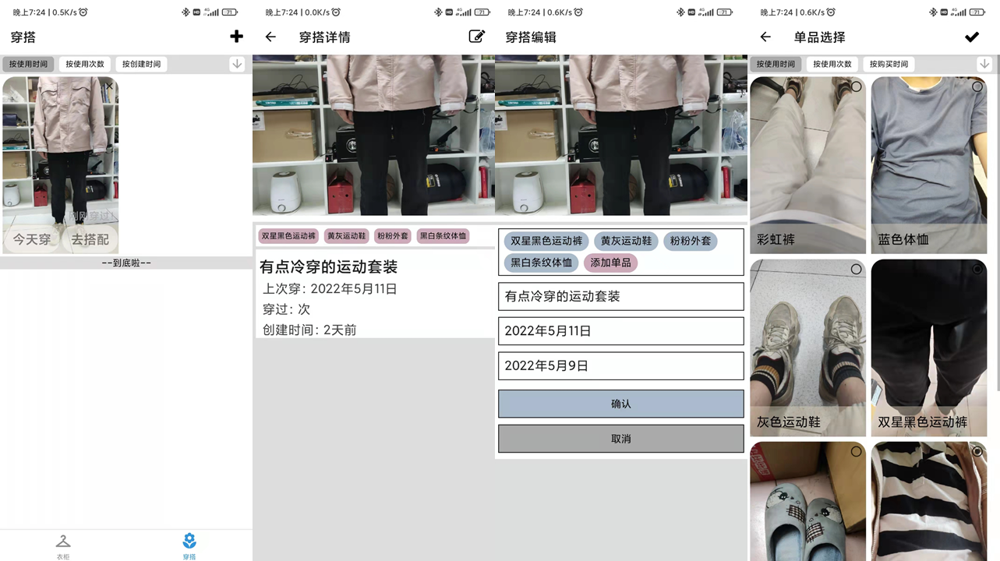

# 明天穿啥

**明天穿啥**，你的衣物管理和穿搭小助手！

基于react-native开发的衣物管理APP，所有数据均使用本地存储，所有功能均可离线使用。

## 主要功能

- 衣物
  - 录入衣物数据
  - 根据最近使用时间、使用次数和购买时间管理衣物
- 穿搭
  - 记录每日穿搭
  - 关联穿搭和衣物信息

## APK下载

## 页面展示

- 衣物
  - 衣物浏览页面

  - 衣物详情页面

  - 衣物编辑页面

    

- 穿搭

  - 穿搭浏览页面

  - 穿搭详情页面

  - 穿搭编辑页面

  - 衣物选择页面

    

    

## 赞助

如果这个项目对您有所帮助，或者您鼓励作者对这个项目的继续开发，欢迎扫码赞助~

